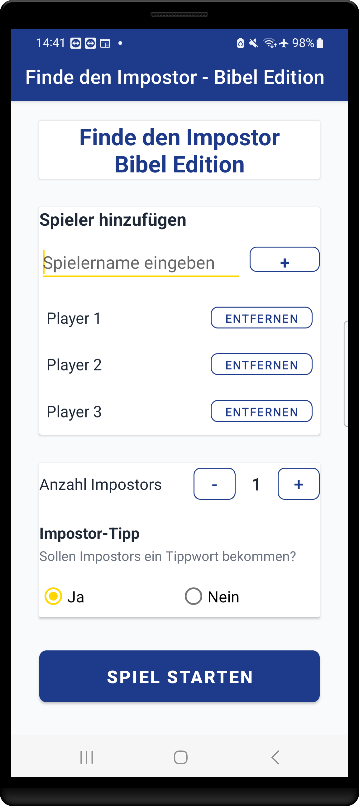
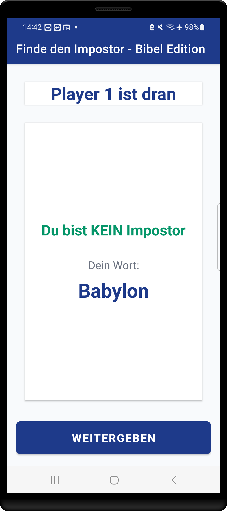
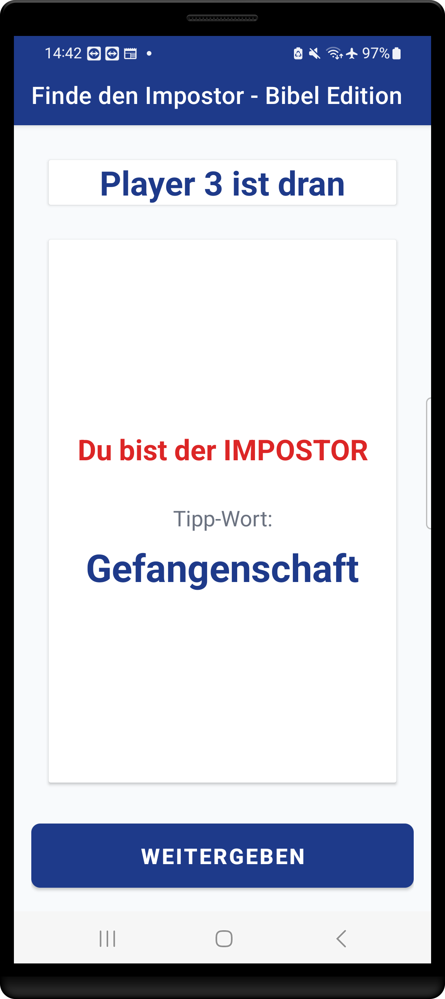
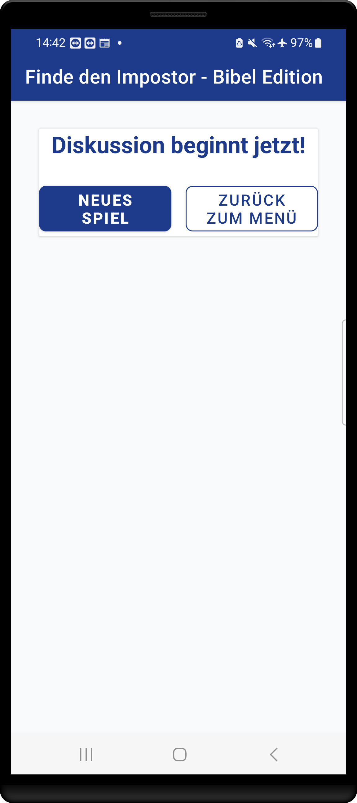

# Finde den Impostor - Bibel Edition

**Status:** ✅ Live & Produktiv - Vollständig funktionsfähige Android-Anwendung  
**Plattform:** Android (Native Kotlin)  
**Zielgruppe:** Christliche Gemeinschaften, Jugendgruppen, Familien

Eine moderne Android-Anwendung, die das beliebte "Impostor"-Spielprinzip mit über 500 biblischen Begriffen kombiniert. Entwickelt für christliche Gemeinschaften als unterhaltsame Möglichkeit, biblisches Wissen spielerisch zu vertiefen.

## 📱 Sofort testen

  

**Direkt-Download:** [Impostor - Bible Edition.apk](https://github.com/eiricliu/Find-the-Impostor-Bible-Edition/raw/main/app/build/outputs/apk/debug/Impostor%20-%20Bible%20Edition.apk) (4.2 MB)

## Aktueller Status

- ✅ **Vollständig entwickelt** - Alle Kernfunktionen implementiert
- ✅ **Native Android App** - Optimiert für Android 7.0+ (API 24-34)  
- ✅ **500+ biblische Begriffe** - Umfassende Wortdatenbank
- ✅ **Offline-Funktionalität** - Keine Internetverbindung erforderlich
- ✅ **Material Design 3** - Moderne, benutzerfreundliche Oberfläche
- ✅ **Deutsche Lokalisierung** - Vollständig übersetzt

## Funktionen

### Spielmechanik
- **Lokales Multiplayer-Spiel** für 3-10 Spieler auf einem Gerät
- **Intuitive Wischgesten-Steuerung** für die Rollenaufdeckung  
- **Flexible Impostor-Anzahl** mit automatischer Validierung
- **Optionale Tipp-Funktion** für Impostors zur Schwierigkeitsanpassung

### Biblischer Inhalt  
- **500+ biblische Begriffe** kategorisiert nach:
  - Personen (Abraham, David, Paulus, Maria...)
  - Orte (Jerusalem, Bethlehem, Galiläa...)  
  - Objekte (Arche, Kreuz, Tempel...)
  - Konzepte (Gnade, Hoffnung, Erlösung...)
  - Bücher der Bibel
- **Intelligente Tipp-Wort-Zuordnung** mit thematisch verwandten Begriffen
- **Ausgewogene Wortverteilung** für faire Spielerfahrung

### Benutzeroberfläche
- **Material Design 3** Implementierung
- **Biblisch inspirierte Farbpalette** (Königsblau, Gold, Weiß)
- **Responsive Card-Layout** für optimale Lesbarkeit
- **Barrierefreie Gestaltung** mit hohen Kontrasten

## Technologien

### Technologie-Stack
- **Sprache:** Kotlin (100%)
- **UI Framework:** Android Views mit Material Components  
- **Architektur:** MVVM Pattern
- **Minimum SDK:** API 24 (Android 7.0) - 94% Marktabdeckung
- **Target SDK:** API 34 (Android 14)
- **Build System:** Gradle

### Kernkomponenten
- **Gesture Detection** - Custom Swipe-Handler für Rollenaufdeckung
- **RecyclerView Adapter** - Dynamische Spielerverwaltung
- **State Management** - Zustandsbasierte UI-Updates  
- **Wortdatenbank** - 500+ biblische Begriffe mit Tipp-System

## Spielablauf

### 1. Spielvorbereitung
- Eingabe von 3-10 Spielernamen mit Duplikatsprüfung
- Auswahl der Impostor-Anzahl (1 bis n-1)  
- Aktivierung/Deaktivierung der Impostor-Tipp-Funktion

### 2. Rollenzuteilung
- Sequenzielle Geräteübergabe zwischen Spielern
- Aufdeckung der Rolle durch Upward-Swipe-Geste
- Farbkodierte Rollenanzeige (Grün: Innocent, Rot: Impostor)
- Automatische Wort- oder Tipp-Zuteilung

### 3. Diskussionsphase  
- Nahtloser Übergang zur Diskussion nach allen Spielern
- Optionen für Neustart oder Hauptmenü-Rückkehr

## Screenshots

  
  
  

  
  

## Installation & Test
1. **APK herunterladen:** [Impostor - Bible Edition.apk](https://github.com/eiricliu/Find-the-Impostor-Bible-Edition/raw/main/app/build/outputs/apk/debug/Impostor%20-%20Bible%20Edition.apk)
2. **Auf Android-Gerät übertragen** (USB, E-Mail, Cloud)
3. **"Unbekannte Quellen" aktivieren** in den Android-Einstellungen
4. **APK installieren** durch Antippen der Datei
5. **App starten** und sofort testen!

### System-Anforderungen
- **Android 7.0+** (API Level 24 oder höher)
- **4 MB freier Speicher** für Installation
- **Keine Internetverbindung** erforderlich

## Entwicklungs-Highlights

### Code-Qualität
- **Kotlin Coding Conventions** konsequent umgesetzt
- **Null Safety** durch Kotlin's Type System
- **ViewBinding** für effiziente UI-Referenzen
- **Gesture Recognition** mit Android's GestureDetector API

### Performance
- **Memory-effiziente** Implementierung  
- **Smooth Animations** durch Hardware-Beschleunigung
- **Offline-Funktionalität** ohne Netzwerkanforderungen
- **Schnelle Startup-Zeit** (< 2 Sekunden)

## Technische Spezifikationen

| Kategorie | Details |
|-----------|---------|
| **Dateigröße** | < 5 MB |
| **RAM-Verbrauch** | < 50 MB |
| **Offline-Fähigkeit** | 100% |
| **Unterstützte Sprachen** | Deutsch |
| **Orientierung** | Portrait |

## Demonstrierte Kompetenzen

### Android Development
- ✅ **Kotlin Programming** - Moderner, idiomatischer Code
- ✅ **Material Design** - UI/UX nach Google-Standards  
- ✅ **Gesture Handling** - Custom Touch-Interaktionen
- ✅ **State Management** - Komplexe UI-Zustandsverwaltung

### Software Engineering  
- ✅ **Clean Architecture** - Separation of Concerns
- ✅ **Error Handling** - Robuste Fehlerbehandlung
- ✅ **Resource Management** - Effiziente Speichernutzung
- ✅ **Testing-Ready** - Testbare Architektur

---

**Entwickelt mit ❤️ für die christliche Gemeinschaft**

*"Dein Wort ist meines Fußes Leuchte und ein Licht auf meinem Wege." - Psalm 119,105*
